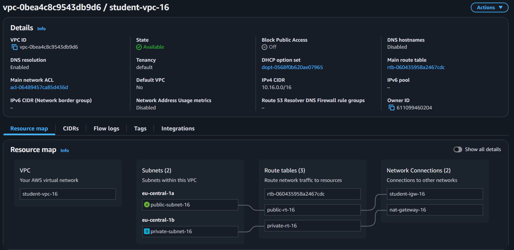
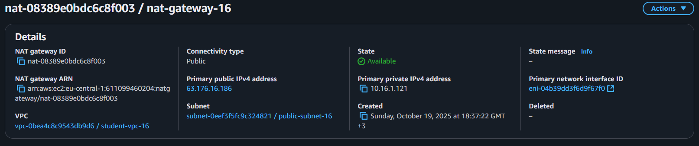
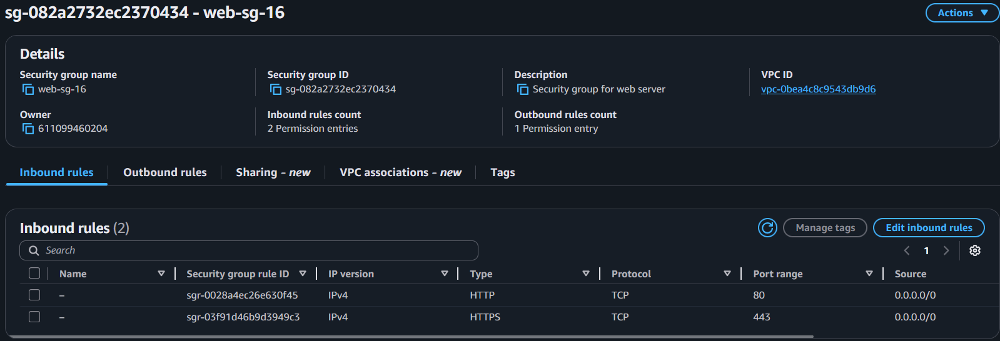

# Лабораторная работа №3. Облачные сети

## Цели работы

Научиться вручную создавать виртуальную сеть (VPC) в AWS, добавлять в неё подсети, таблицы маршрутов, интернет-шлюз (IGW) и NAT Gateway, а также настраивать взаимодействие между веб-сервером в публичной подсети и сервером базы данных в приватной.

После выполнения работы студент:

- понимает, как формируется изоляция сетей в AWS (VPC);
- умеет создавать и связывать компоненты сети;
- знает, как EC2-инстансы разных подсетей взаимодействуют друг с другом;
- различает публичные и приватные маршруты.

## Условия

Amazon VPC (Virtual Private Cloud) — это ваша собственная виртуальная сеть в облаке AWS. Она полностью изолирована от других пользователей и позволяет вам управлять адресным пространством, подсетями, шлюзами и безопасностью.

В типичном сценарии у нас есть:

- Публичная подсеть. Для веб-сервера (имеет выход в интернет).
- Приватная подсеть. Для базы данных (без прямого доступа извне).
- NAT Gateway. Чтобы приватные ресурсы имели доступ в интернет (например, для обновления ПО).
- Route Tables. Определяют, куда направлять трафик.
- Security Groups. Управляют входящими и исходящими соединениями на уровне инстансов.
- EC2-инстансы. Веб-сервер, сервер базы данных и bastion host.

Конечная архитектура сети, созданной в этой лабораторной работе, будет выглядеть следующим образом:


## 1. Создание VPC

Создана виртуальная сеть (VPC) с адресным пространством 10.16.0.0/16.



> Что обозначает маска /16? И почему нельзя использовать, например, /8?

Маска сети 16 означает что, 16 бит уходит на идентификацию сети, тоесть 00000000.00000000/00000000.00000000

Маску /8 использовать нельзя, потому что AWS ограничивает размер подсетей: минимальная маска — `/28`, максимальная — `/16`.

## 2. Создание Internet Gateway (IGW)

Создан и прикреплён IGW student-igw-16 к сети student-vpc-16.

Теперь ресурсы VPC могут выходить в Интернет при наличии правильных маршрутов.

## 3. Создание подсетей

### 3.1. Публичная подсеть

```
Имя: public-subnet-16
CIDR: 10.16.1.0/24
Зона доступности: eu-central-1a
```

> Является ли подсеть "публичной" на данный момент? Почему?

Нет, подсеть становится публичной только после привязки таблицы маршрутов, в которой есть маршрут 0.0.0.0/0 к Internet Gateway

### 3.2. Приватная подсеть


```
Name: private-subnet-16
CIDR: 10.16.2.0/24
Зона доступности: eu-central-1b
```

> Является ли подсеть приватной на данный момент? Почему?

Да, по умолчанию она приватная, так как её таблица маршрутов не содержит выходов в Интернет (нет маршрута к IGW).

## 4. Создание таблиц маршрутов (Route Tables)

### 4.1. Публичная таблица маршрутов

```
Name: public-rt-16
Route: 0.0.0.0/0 → Internet Gateway (student-igw-16)
Subnet association: public-subnet-16
```

> Зачем необходимо привязать таблицу маршрутов к подсети?

Без привязки подсеть не будет использовать маршруты из таблицы

### 4.2. Приватная таблица маршрутов

```
Name: private-rt-16
Subnet association: private-subnet-16
```

На данном этапе доступ в Интернет отсутствует — NAT Gateway ещё не создан.

## 5. Создание NAT Gateway

> Как работает NAT Gateway?

NAT Gateway позволяет приватным инстансам выходить в Интернет, используя его публичный IP-адрес. Он заменяет исходный приватный IP-адрес на свой публичный при отправке пакетов наружу, а ответы возвращает обратно.

### 5.1. Создание Elastic IP

Выделен Elastic IP — статический публичный адрес для NAT Gateway.

### 5.2. Создание NAT Gateway

```
Name: nat-gateway-16
Subnet: public-subnet-16
```



### 6.3. Настройка маршрута для приватной таблицы

Добавлен маршрут:

- `0.0.0.0/0 → NAT Gateway (nat-gateway-16)`

Теперь приватная подсеть имеет исходящий доступ в Интернет через NAT Gateway.

## 6. Создание Security Groups

Созданы три группы безопасности:

web-sg-16

- `HTTP (TCP 80) — источник 0.0.0.0/0`
- `HTTPS (TCP 443) — источник 0.0.0.0/0`



bastion-sg-16

- `SSH (TCP 22) — источник: только IP-адрес пользователя`

db-sg-16

- `MySQL (TCP 3306) — источник: web-sg-16`
- `SSH (TCP 22) — источник: bastion-sg-16`

> Что такое Bastion Host и зачем он нужен в архитектуре с приватными подсетями?

Bastion Host — это специально выделенный сервер в публичной подсети, через который осуществляется безопасный доступ (обычно по SSH) к ресурсам в приватной подсети. Он играет роль “точки входа” и защищает приватные ресурсы от прямого доступа из Интернета.

## 7. Создание EC2-инстансов

Созданы три EC2-инстанса

1. web-server
1. db-server
1. bastion-host


## 8. Проверка работы

Открыв публичный `IP` `web-server` в браузере, отображается страница `PHP Info` — значит, `HTTP` работает.

Подключение к `bastion-host` по `SSH` прошло успешно.

`ping google.com` подтверждает корректную работу `IGW` в публичной подсети.

С `bastion-host` успешно выполнено подключение к `db-server` через `mysql -h <private-IP> -u root -p` — NAT и маршруты работают правильно.

## 9. Подключение в приватную подсеть через Bastion Host

Использован SSH Agent Forwarding

```bash
$ eval "$(ssh-agent -s)"
$ ssh-add student-key-16.pem
$ ssh -A -J ec2-user@<Bastion-IP> ec2-user@<DB-Server-Private-IP>
```

> Что делают опции -A и -J?


- `-A` — включает SSH Agent Forwarding, то есть передаёт SSH-ключ с локальной машины через bastion-host, чтобы можно было авторизоваться на внутренних серверах без копирования ключа
- `-J` — задаёт ProxyJump, то есть указывает промежуточный сервер (bastion-host), через который нужно подключиться к целевому инстансу.