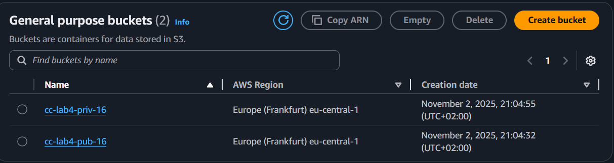
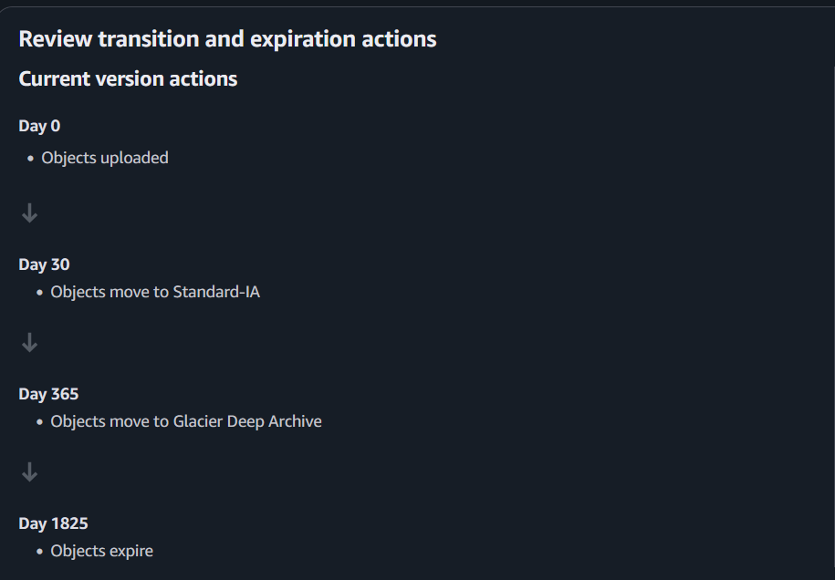
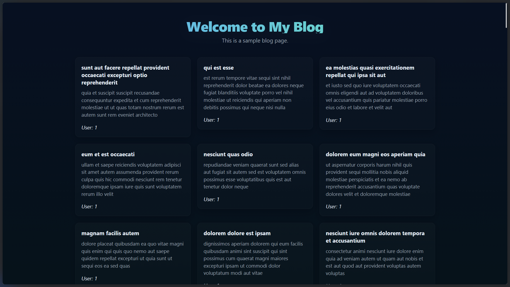

# Лабораторная работа №4. Облачное хранилище данных. Amazon S3

## Цель работы

Целью работы является познакомиться с сервисом Amazon S3 (Simple Storage Service) и отработать основные операции:

- создание публичного и приватного бакетов;
- загрузку и организацию объектов;
- работу с S3 через AWS CLI (копирование, перемещение, синхронизация);
- настройку версионирования и шифрования;
- использование S3 Static Website Hosting;
- применение Lifecycle-правил для архивирования старых данных.

## Условие

_Amazon S3_ — это объектное хранилище AWS, предназначенное для хранения файлов любого типа: изображений, резервных копий, документов, логов и т.д. Каждый объект хранится внутри _бакета_ (bucket) и имеет _уникальный ключ_ (key). "Папки" в консоли — это лишь префиксы ключей, а не настоящие директории.

В этой лабораторной вы создадите два бакета:

- _Публичный бакет_ - для хранения аватаров пользователей и статического контента;
- _Приватный бакет_ - для логов и служебных файлов (с Lifecycle-политикой).

## Шаг 1. Подготовка

Локально (на своем компьютере) создаю структуру каталогов и файлов, как показано ниже:

   ```
   s3-lab/
    ├── public/
    │   ├── avatars/
    │   │   ├── user1.jpg
    │   │   └── user2.jpg
    │   └── content/logo.png
    ├── private/
    │   └── logs/
    │       └── activity.csv
    └── README.md
   ```


## Шаг 2. Создание бакетов

На данном шаге студент может выбрать один из способов создания бакетов:

- использовать ACL (упрощённый, наглядный),
- использовать Object Ownership Enforced (современный, безопасный).

> Различие между способами управления доступом к бакетам S3:
> - `ACL` (`Access Control List`) — старый способ, при котором права задаются на уровне отдельных объектов и бакетов. Менее безопасен, т.к. легко допустить публичный доступ. Используется в учебных целях и для совместимости.
> - `Object Ownership` (`Bucket owner enforced`) — современный и безопасный способ. ACL полностью отключаются, все объекты принадлежат владельцу бакета, а доступ управляется только через IAM и Bucket Policy. Рекомендуется AWS для использования в продакшне.

Создаю один публичный и один приватный бакет используя `ACL`



## Шаг 3. Загрузка объектов через AWS Management Console

1. Перехожу в бакет **cc-lab4-pub-16** в консоли **AWS Management Console**.  
2. Внутри бакета открываю директорию **avatars/**.  
3. Нажимаю кнопку **Upload**.  
4. Выбираю локальный файл **user1.jpg**, расположенный по пути  
   `s3-lab/public/avatars/user1.jpg`.  
5. В разделе **Permissions** устанавливаю параметр **Grant public-read access**, чтобы сделать файл доступным для чтения всеми пользователями.  
6. Завершаю загрузку, нажав **Upload**.  

> Чем отличается ключ (object key) от имени файла?
>
> **Имя файла** — это имя самого файла в локальной файловой системе, например `user1.jpg`.
>
> **Ключ (object key)** — это уникальный путь к объекту внутри бакета S3, включающий “виртуальную директорию”.  
> Например, для загруженного файла ключ будет:  
`avatars/user1.jpg`

## Шаг 4. Загрузка объектов через AWS CLI

## Шаг 4. Загрузка объектов через AWS CLI

### Ход выполнения работы

Загружаю файл **user2.jpg** в публичный бакет **cc-lab4-pub-16** в директорию `avatars/`, делая его публичным:
   ```bash
   aws s3 cp s3-lab/public/avatars/user2.jpg s3://cc-lab4-pub-16/avatars/user2.jpg --acl public-read
   ```

> В чём разница между командами aws s3 cp, mv и sync и для чего используется параметр флаг --acl public-read?
>
> - **`cp`** — копирует файлы между локальной системой и S3.  
> - **`mv`** — перемещает файлы (копирует и удаляет исходный).  
> - **`sync`** — синхронизирует содержимое папок или бакетов.  
> - **`--acl public-read`** — делает загружаемый объект доступным для публичного чтения.

## Шаг 5. Проверка доступа к объектам

Открываю в браузере ссылку на загруженный публичный объект:  
   [https://cc-lab4-pub-16.s3.eu-central-1.amazonaws.com/avatars/user1.jpg](https://cc-lab4-pub-16.s3.eu-central-1.amazonaws.com/avatars/user1.jpg)

В результате в браузере отображается изображение **user1.jpg**, что подтверждает корректную загрузку и наличие публичного доступа к объекту.

## Шаг 6. Версионирование объектов

1. В консоли **AWS Management Console** перехожу в свойства бакета **cc-lab4-pub-16**.  
2. Открываю вкладку **Properties → Bucket Versioning** и нажимаю **Enable**.  
3. Аналогично включаю версионирование для приватного бакета **cc-lab4-priv-16**.  
4. Изменяю локальный файл **logo.png** и повторно загружаю его в бакет.  
5. Вкладка **Versions** теперь отображает несколько версий одного и того же объекта.

> Что произойдёт, если выключить версионирование после его включения?
>
> Если **выключить версионирование**, новые версии объектов **перестанут создаваться**, но уже существующие версии **сохранятся** и останутся доступными для просмотра и восстановления.  
> При повторной загрузке файла без активного версионирования он будет **перезаписывать** предыдущую версию.

## Шаг 7. Создание Lifecycle-правил для приватного бакета

1. Перехожу в приватный бакет **cc-lab4-priv-16**.  
2. Открываю вкладку **Management → Lifecycle rules** и нажимаю **Create rule**.  
3. Задаю параметры:  
   - **Имя:** logs-archive  
   - **Префикс:** logs/  
   - **Действия (Actions):**  
     - **Transition → Standard-IA** через **30 дней**  
     - **Transition → Glacier Deep Archive** через **365 дней**  
     - **Expiration → удалить** через **1825 дней (5 лет)**  
4. Сохраняю правило, нажав **Create rule**.  



> Что такое Storage Class в Amazon S3 и зачем они нужны?

> **Storage Class** в Amazon S3 — это класс (тип) хранения, определяющий **стоимость и скорость доступа к данным**.  
> Они нужны для **оптимизации расходов**:  
> часто используемые данные хранятся в более дорогих классах (например, *Standard*), а редко используемые — в дешёвых и архивных (*Standard-IA*, *Glacier*, *Glacier Deep Archive*).  
>
> `Lifecycle-правила` позволяют автоматически переводить объекты между классами хранения и удалять старые данные.

## Шаг 8. Создание статического веб-сайта на базе S3

1. Создаю бакет **cc-lab4-web-16**:  
   - **Region:** eu-central-1  
   - **Object Ownership:** ACLs enabled (Can be configured using ACLs)  
   - **Block all public access:** снята галочка (разрешен публичный доступ)  
   - Нажимаю **Create bucket**  

2. Настраиваю хостинг статического сайта:  
   - Перехожу в бакет → **Properties → Static website hosting → Edit → Enable**  
   - **Hosting type:** Host a static website  
   - **Index document:** index.html  
   - Сохраняю настройки  

3. Копирую файлы веб-сайта в бакет **cc-lab4-web-16**, устанавливая **публичный доступ** для всех файлов.  

4. Открываю URL статического сайта, указанный в настройках S3, чтобы убедиться в работе сайта.  




