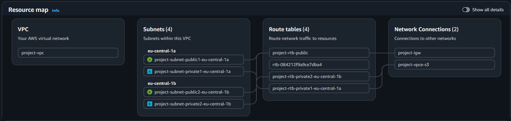
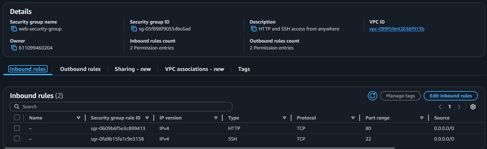
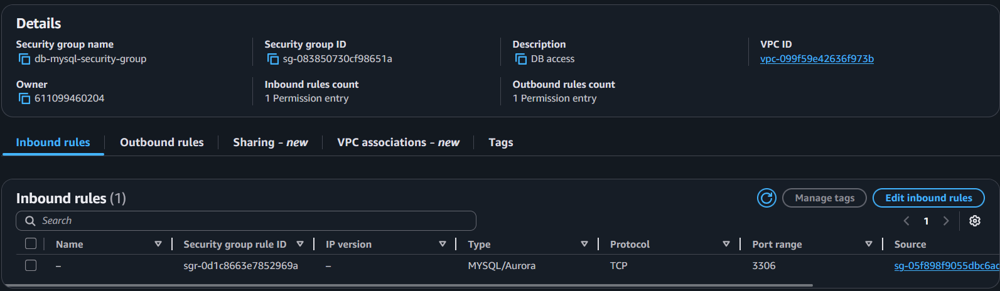
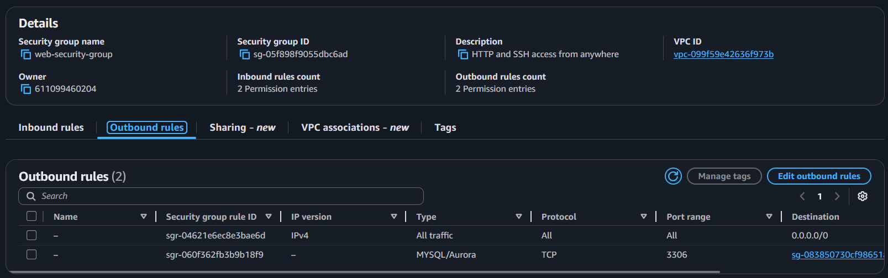
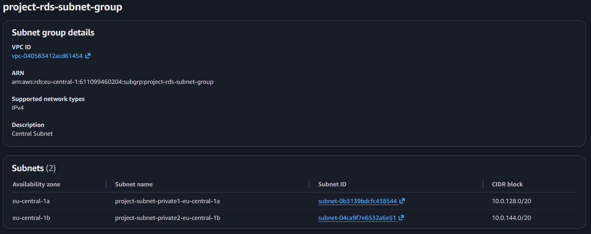
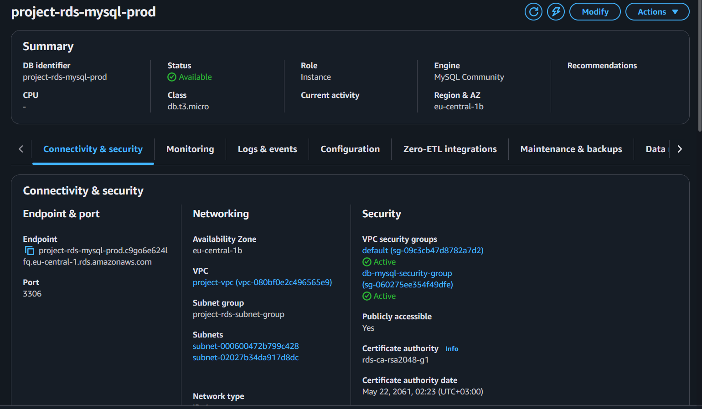
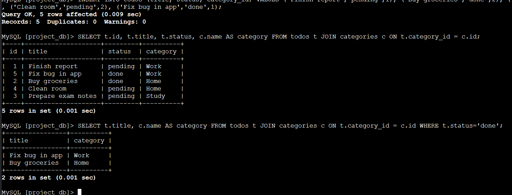
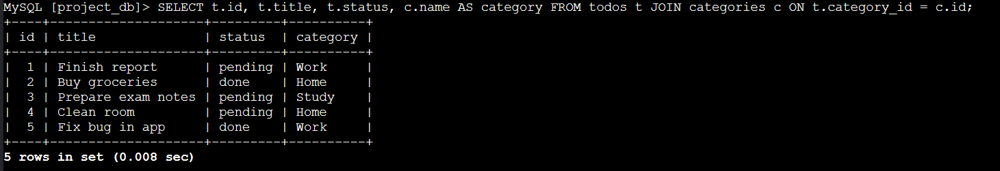
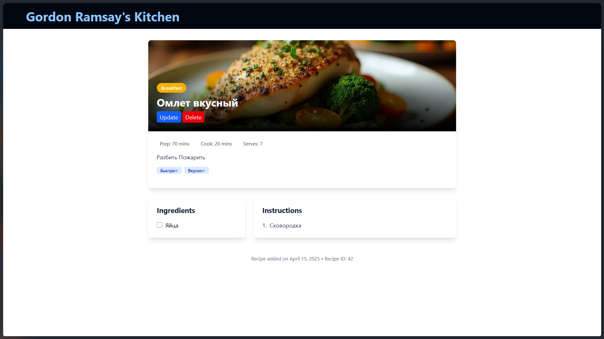

# Лабораторная работа №5. Облачные базы данных. Amazon RDS, DynamoDB

## Цель работы

Целью работы является ознакомиться с сервисами Amazon RDS (Relational Database Service) и Amazon DynamoDB, а также научиться:

- Создавать и настраивать экземпляры реляционных баз данных в облаке AWS с использованием Amazon RDS.
- Понимать концепцию Read Replicas и применять их для повышения производительности и отказоустойчивости баз данных.
- Подключаться к базе данных Amazon RDS с виртуальной машины EC2 и выполнять базовые операции с данными (создание, чтение, обновление, удаление записей - CRUD).

## Шаг 1. Подготовка среды (VPC/подсети/SG)

Создаю VPC (`project-vpc`) с двумя публичными и двумя приватными подсетями в разных зонах доступности (AZ). В данной подсети будут развернуты базы данных и приложение



Создаю группу безопасности (`web-security-group`) для приложения, разрешающий следующий трафик



Создаю группу безопасности (`db-mysql-security-group`) для базы данных, разрешающий следующий трафик: 



Изменяю `web-security-group`, добавив правило для исходящего трафика (мое приложение сможет инициализировать соединение с базой данных): 



## Шаг 2. Развертывание Amazon RDS

Создаю Subnet Group для вашей базы данных

> Subnet Group - список подсетей, где AWS может создать базу данных



Создаю экземпляр базы данных Amazon RDS

## Шаг 3. Создание виртуальной машины для подключения к базе данных

Создаю виртуальную машину EC2 в публичной подсети вашего VPC, чтобы использовать её для подключения к базе данных RDS.



Проверяю работоспособнось бд



## Шаг 5. Создание Read Replica

Создаю реплику, подключаюсь и проверяю `select`



Результат такой же поскольку реплика копирует основную базу данных и применяет все изменения из основной на себе

Пробую сделать `insert`

```
ERROR 1290 (HY000): The MySQL server is running with the --read-only option so it cannot execute this statement
```

Replica предназначена только для чтения

Возвращаюсь в основную, добавляю новую запись, возвращаюсь в реплику - запись присутствует.

MySQL Read Replica работает на основе binlog-based replication:

- Primary записывает изменения в свой binary log
- Реплика считывает binlog и применяет те же операции у себя
- Поэтому данные на реплике повторяют данные на Primary

> Объясните, зачем нужны Read Replicas и в каких сценариях их использование будет полезным.

Read Replicas нужны для разгрузки основной базы данных и повышения производительности чтения.

## Шаг 6. Подключение приложения к базе данных

Использую лабораторную работу из php, настраиваю подключение к базе данных под созданную `aurora mysql` и копирую приложение на ec2

Провожу миграции, сидеры и проверяю работоспособность приложения 



