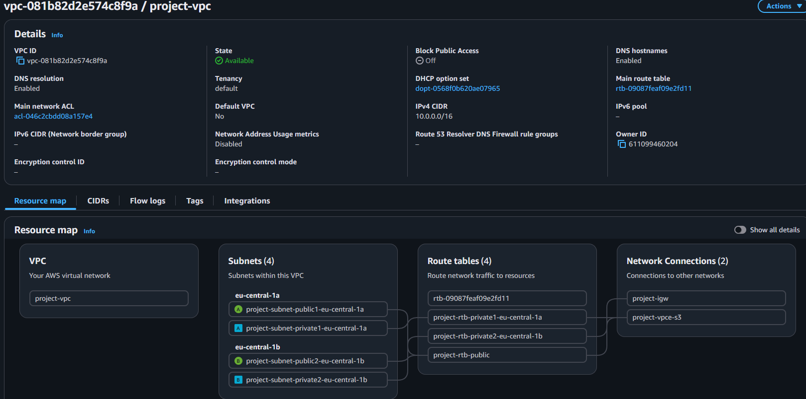
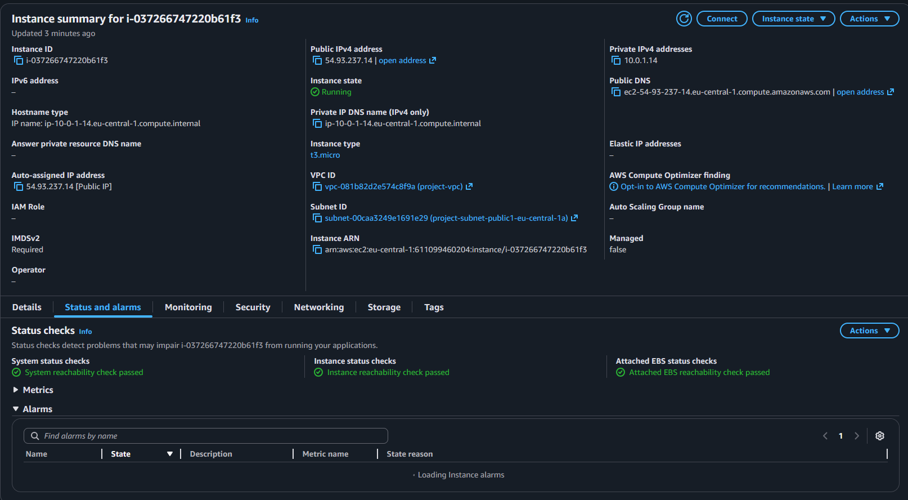
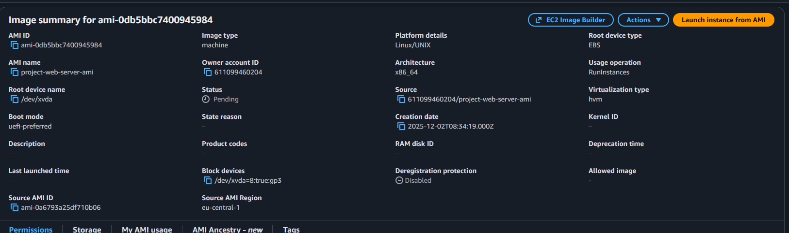
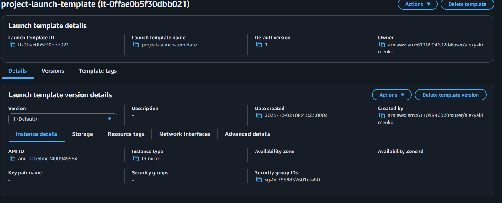
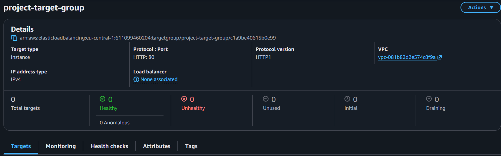
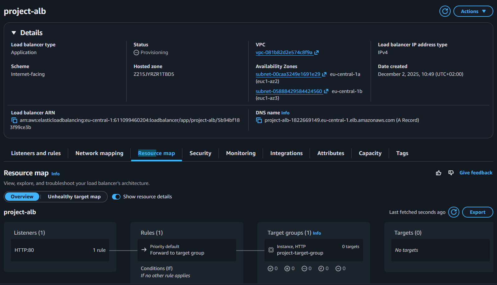
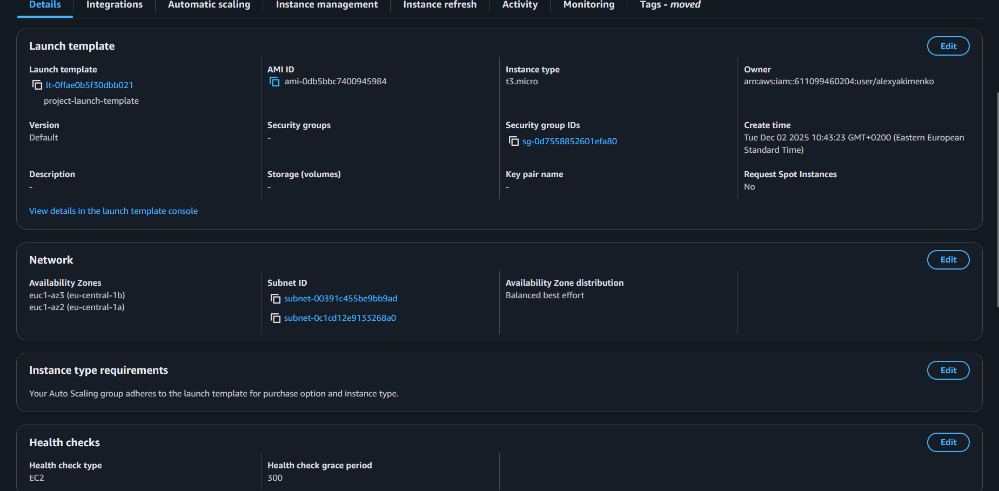
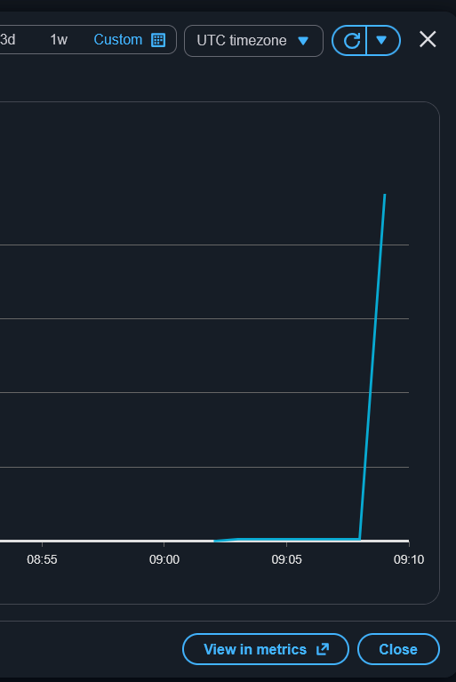
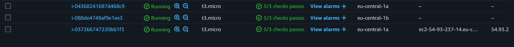

# Лабораторная работа №6. Балансирование нагрузки в облаке и авто-масштабирование

## Цель работы
Закрепить навыки работы с AWS EC2, Elastic Load Balancer, Auto Scaling и CloudWatch, создав отказоустойчивую и автоматически масштабируемую архитектуру.

Студент развернёт:

- VPC с публичными и приватными подсетями;
- Виртуальную машину с веб-сервером (nginx);
- Application Load Balancer;
- Auto Scaling Group (на основе AMI);
- Нагрузочный тест с использованием CloudWatch.

## Шаг 1. Создание VPC и подсетей

## Шаг 2. Создание и настройка виртуальной машины

## Шаг 3. Создание AMI

В `EC2` выбераю `Instance` → `Actions` → `Image and templates` → `Create image`.

> Что такое image и чем он отличается от snapshot? Какие есть варианты использования AMI?

AMI — это полный образ готового сервера (ОС + настройки + приложения), из которого можно запускать EC2, а snapshot — это лишь копия диска, без возможности развернуть сервер напрямую

## Шаг 4. Создание Launch Template

> Что такое Launch Template и зачем он нужен? Чем он отличается от Launch Configuration?

Launch Template — это шаблон запуска EC2, который хранит все параметры инстанса (AMI, тип, сеть, SG и т.д.) и используется Auto Scaling для создания новых серверов; в отличие от устаревшего Launch Configuration, его можно версионировать, обновлять и он поддерживает больше функционала AWS.

## Шаг 5. Создание Target Group

> Зачем необходим и какую роль выполняет Target Group?

Target Group — это группа целевых серверов (EC2), к которым балансировщик отправляет трафик; она контролирует, какие инстансы получают запросы, проверяет их здоровье и обеспечивает распределение нагрузки.

## Шаг 6. Создание Application Load Balancer

> В чем разница между Internet-facing и Internal?

`Internet-facing`

- Балансировщик получает публичный IP и доступен из интернета.
- Клиенты могут обращаться к ALB напрямую из любой сети.

`Internal`

- Балансировщик работает только внутри VPC, не имеет публичного IP.
- Используется для внутренних сервисов (микросервисы, приватные API).

> Что такое Default action и какие есть типы Default action?

Default action — это действие, которое ALB выполняет, если запрос не совпал ни с одним правилом маршрутизации 

Бывают:

- Forward -> Отправить запрос в Target Group
- Redirect -> Перенаправить
- Return fixed response -> Статический ответ

## Шаг 7. Создание Auto Scaling Group

> Почему для Auto Scaling Group выбираются приватные подсети?

Потому что инстансы должны быть защищены и недоступны напрямую из интернета — весь входящий трафик должен идти через Load Balancer, а не напрямую в EC2.

> Зачем нужна настройка: Availability Zone distribution?

Эта настройка определяет, как Auto Scaling будет распределять инстансы между зонами доступности.

> Что такое Instance warm-up period и зачем он нужен?

Instance warm-up period — это время, которое даётся новому инстансу после запуска, чтобы:

- он полностью загрузился,
- стартовали сервисы,
- приложение начало принимать трафик,
- метрики (например, CPU) стали корректными.

Это необходимо для того, чтобы Auto Scaling не воспринял высокую нагрузку при старте как реальную и не начал преждевременно масштабироваться.

## Шаг 8. Тестирование Application Load Balancer

При переходе по `DNS` `Load Balancer`-а я после и периодичном обновлении страницы, я вижу разные ip адреса, поскольку ALB распределяет нагрузку между инстансами `Target Group`

## Шаг 9. Тестирование Auto Scaling

> Какую роль в этом процессе сыграл Auto Scaling?

Auto Scaling автоматически увеличил количество EC2-инстансов, потому что обнаружил рост нагрузки (CPU выше цели 50%), создал Alarm и добавил новые серверы, чтобы стабилизировать производительность и удержать метрику в заданных пределах.

## Шаг 10. Завершение работы и очистка ресурсов

